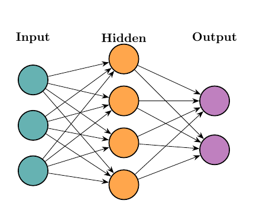
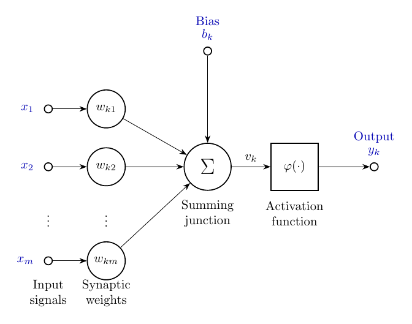
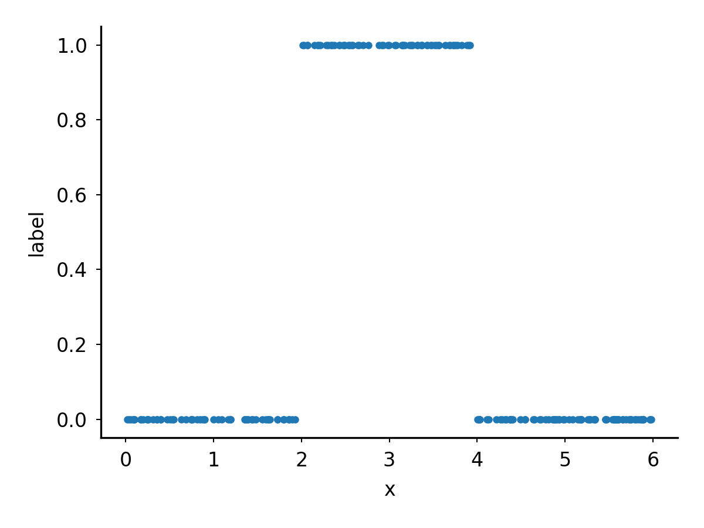

# Neural Networks

## Architecutre

| Neural netowrk | Digital neuron |
|-|-|
|  | 
<details>

```
pdflatex \
    -output-directory=img/cartoons \
    img/cartoons/small_nn.tex

pdftoppm \
    -png \
    -r 150 \
    img/cartoons/small_nn.pdf \
    img/cartoons/small_nn

pdflatex \
    -output-directory=img/cartoons \
    img/cartoons/neuron_model.tex

pdftoppm \
    -png \
    -r 150 \
    img/cartoons/neuron_model.pdf \
    img/cartoons/neuron_model
```

</details>

- Inputs ($x_1 \dots x_m$) The raw numerical features fed into the network
  representing the initial data points (e.g., pixel intensities, house square
  footage, or word embeddings). They form the input layer and pass forward
  through the connections without modifications of their own.
- Weights
- Aggregation
- Bias
- Activation funcitons
- Outputs


## Gernate interval data file

A NN can fit a curve to almost any dataset
We are going to use a complete sytetic dataset 
Goign to try and find the start and end of an interval
This could be the effective dosage range for some treament



<details>

```bash
python src/make_interval_dataset.py \
    --out out/interval.data.tsv
wrote out/interval.data.tsv: 200 points, 32.0% positive, baseline accuracy = 0.680

tail -n +2 out/interval.data.tsv \
| python src/plot_line.py \
    -o img/interval.data.png \
    -x "x" \
    -y "label" \
    --point_size 4 \
    --markeredgecolor "tab:blue" \
    --markerfacecolor "tab:blue"
```

</details>


## Train

```bash
python src/train_interval_nn.py \
    --data out/interval.data.tsv \
    --out_prefix out/interval
```
