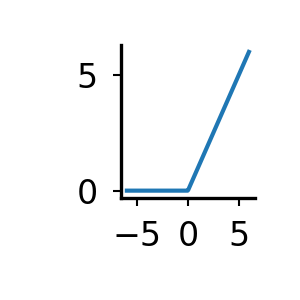
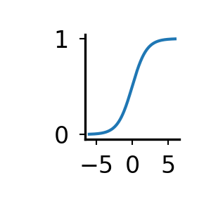
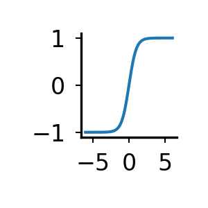
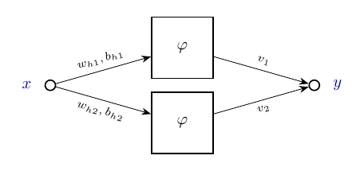
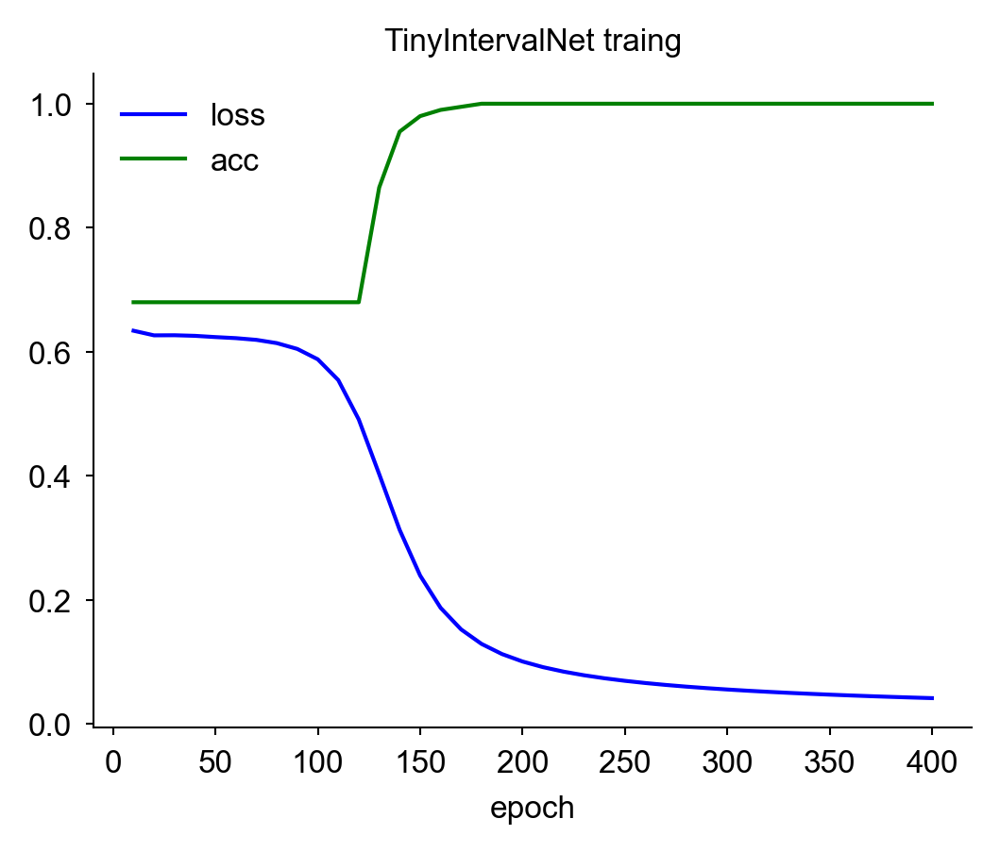

# Neural Networks

Neural networks are a computing model inspired by biology that learns patterns
directly from data. They can recognize complex non-linear relationships and are
widely used in computer vision, natural language processing, speech
recognition, and predictive analytics.

A neural network is organized into layers of interconnected processing units
that pass information forward from input to output. The architecture begins
with an input layer that takes raw feature data. This data is transformed
through one or more hidden layers to extract progressively complex patterns
before reaching a final output layer that produces the prediction.

Individual units within these layers are digital neurons. Every digital neuron
independently receives inputs from the preceding layer, multiplies them by its
weights, adds a bias, runs the total through an activation function, and
broadcasts its output forward to the neurons in the next layer. The network
learns these parameters through training, where large amounts of data are
passed through the network and individual weights and biases are updated based
on how close the prediction is to the target answer.

| Neural netowrk | Digital neuron |
|-|-|
|  | 
<details>

```
pdflatex \
    -output-directory=img/cartoons \
    img/cartoons/small_nn.tex

pdftoppm \
    -png \
    -r 150 \
    img/cartoons/small_nn.pdf \
    img/cartoons/small_nn

pdflatex \
    -output-directory=img/cartoons \
    img/cartoons/neuron_model.tex

pdftoppm \
    -png \
    -r 150 \
    img/cartoons/neuron_model.pdf \
    img/cartoons/neuron_model
```

</details>

- Digital neuron
  - Inputs ($x_1 \dots x_m$): Numerical feature signals fed directly into the
    neuron from external data or upstream neurons.
  - Weights ($w_{k1} \dots w_{km}$): Adjustable numerical coefficients assigned
    to every incoming connection that dictate the strength and influence of
    each input signal. During training, the network updates these parameters to
    learn which features matter most for accurate predictions.
  - Aggregation ($\sum$): Each input value is multiplied by its corresponding
    weight and summed together. This collects all incoming weighted signals
    into a single scalar value.
  - Bias: A learnable constant value added to the aggregated weighted sum. It
    acts as an offset, allowing the activation function to shift left or right
    along the axis so the neuron can fit data patterns that do not pass through
    the origin.
  - Activation funciton ($\varphi$): Mathematical functions applied to the
    aggregated sum and bias to introduce non-linearity, which is essential for
    learning complex, real-world relationships. Common
    choices include:
      - ReLU: Zeroes out negative inputs to introduce non-linearity efficiently
        and encourage sparsity.
        
        <details>

        ```bash
        python3 -c "
            import numpy as np
            x = np.linspace(-6, 6, 200)
            y = np.maximum(x, 0)
            for xi, yi in zip(x, y): print(xi, yi)
        " | python3 src/plot_line.py \
            -o img/act_relu.png \
            --width 1 \
            --height 1 --line_style "-"
        ```

        </details>
      - Sigmoid: Squashes values into a range between $0$ and $1$, making it
        ideal for binary probabilities.
        
        <details>

        ```bash
        python3 -c "
            import numpy as np
            x = np.linspace(-6, 6, 200)
            y = 1/(1+np.exp(-x))
            for xi, yi in zip(x, y): print(xi, yi)
        " \
        | python3 src/plot_line.py \
            -o img/act_sigmoid.png \
            --width 1 \
            --height 1 \
            --line_style "-"
        ```

        </details>

      - Tanh: Maps values between $-1$ and $1$, providing zero-centered outputs
        for smoother training.
        
        <details>

        ```bash
        python3 -c "
            import numpy as np
            x = np.linspace(-6, 6, 200)
            y = np.tanh(x)
            for xi, yi in zip(x, y): print(xi, yi)
        " \
        | python3 src/plot_line.py \
            -o img/act_tanh.png \
            --width 1 \
            --height 1 \
            --line_style "-"
        ```

        </details>

  - Output: The final scalar output signal produced by the neuron after
    activation. This value serves as the single prediction for binary models or
    is broadcast forward as an input to downstream digital neurons in a
    network.


## Supervised Training

Training a neural network is an iterative process where the model learns by
sending its training data, which it knows the answers to, through the network
to generate predictions. We then measures how far off those predictions are
from the anwers, and use that error to update the model parametes (weights and
biases) to improve accuracy. 

### Training Parameters & Metrics
- Parameters: The weights and biases that the model modifies during training.
  The goal of training is to find values for those parameters that maximizes
  accuracy.
- Loss: A score produced by some cost function that quantifies the difference
  between the current prediction and the answers. A lower loss indicates a
  better-performing model. Loss is the primary signal the model uses to
  adjust its parameters.
- Epoch: One complete pass of the entire training dataset through the network.
  Training typically runs over multiple epochs as the model improves its
  predictions.
- Accuracy: The percentage of total predictions that the model got correct.
  While loss is for the model during training, Accuracy is for 
  human evaluation.

### Example

Here we will use a synthetic dataset designed to model an interval-finding
problem. While this prblem could corresopnd to identifying the effective dosage
range for a drug treatment it is a deliberately simple task so we better track
the training process.

| Architecture | Data set|
|-|-|
|  |  | 

<details>

```bash
python src/make_interval_dataset.py \
    --out out/interval.data.tsv
wrote out/interval.data.tsv: 200 points, 32.0% positive, baseline accuracy = 0.680

tail -n +2 out/interval.data.tsv \
| python src/plot_line.py \
    -o img/interval.data.png \
    -x "x" \
    -y "label" \
    --point_size 4 \
    --markeredgecolor "tab:blue" \
    --markerfacecolor "tab:blue"

pdflatex \
    -output-directory=img/cartoons \
    img/cartoons/interval_nn.tex

pdftoppm \
    -png \
    -r 150 \
    img/cartoons/interval_nn.pdf \
    img/cartoons/interval_nn

```

</details>
 
#### Architecture
- Input Layer: 1 input feature representing the $x$ valyue
- Hidden Layer: 2 digital neurons that  pass their output through a Sigmoid
  activation function. Since a single neuron can only draw one decision
  boundary (e.g., $x>2$), we need two too form the two boundaries ($x>2$ and
  $x<4$) that are required to respreset an interval.
- Output Layer: Combines the activation signals from the hidden neurons into a
  single score (logit) which is then transfomred by a Sigmoid to yield the
  probability of $x$ being in the interval.
- Parameters: 7 total scalar parameters
    - 2 Hidden Weights (`h1_w` and `h2_w`): Weights mapping the single input
      $x$ to the 2 hidden neurons.
    - 2 Hidden Biases (`h1_b` and `h2_b`): Biases shifting the threshold points
      of hidden neurons 1 and 2 along the number line.
    - 2 Output Weights (`out_v1` and `out_v2`): Weights that control how teh
      influence each hidden neuron's activation has on the final score.
    - 1 Output Bias (`out_b`): The baseline offset for the final classification
      layer.

### Training metris
- Loss: How far off the predictions are from the true targets. Here we use
   Binary Cross-Entropy Loss. Binary indicates a 2-class classification problem
   (in interval or not), and Cross-Entropy is a family of loss functions that
   measures the difference between 0/1 labels and predicted probabilities,
   heavily penalizing confident wrong predictions.
- Epoch: One of the 400 cycles where the complete training dataset is passed
  through the model, loss is calculated, and parameters are adjusted.
- Accuracy (acc): The proportion of samples correctly identified as inside or
  outside the target interval.


Over 400 epochs, the model shifts from stagnation to strong convergence. For
the first 120 epochs, the model makes minimal progress with accuracy staying
flat at 0.68 while loss drops slowly from 0.634 to 0.491.  Between epochs 130
and 180, training accelerates with loss dropping from 0.402 to 0.129 and 
accuracy rising from 0.865 to a 1.0. Across the final 220 epochs, accuracy
remains at 1.000 while the loss drops down to 0.041.



<details>

```bash
python src/train_interval_nn.py \
    --data out/interval.data.tsv \
    --snapshot_every 10 \
    --out_prefix out/interval

epoch 0400 loss=0.0419 acc=1.000 h1_w=+3.246 h1_b=-12.963 h2_w=-4.748 h2_b=+9.216 out_v1=-12.481 out_v2=-12.286 out_b=+5.840
wrote out/interval.params.tsv

python src/plot_interval_training.py \
    -i out/interval.params.tsv \
    -o out/interval_training.png \
    --title "TinyIntervalNet traing"
```

</details>

## Infrence

```bash
python src/interval_nn_inference.py \
    --h_w 3.246 -4.748 \
    --h_b -12.963 9.216 \
    --out_v -12.481 -12.286 \
    --out_b 5.840 \
    --x 0.5 1.9 2.1 3.0 3.9 4.1 5.5
```

## Train 
